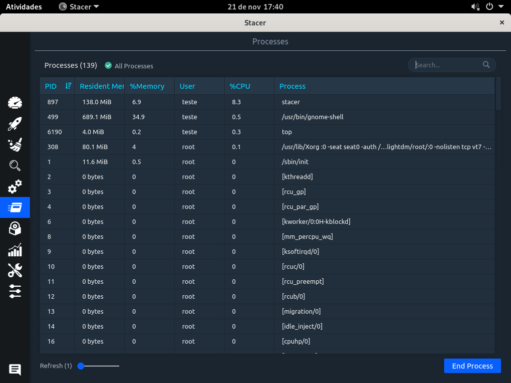
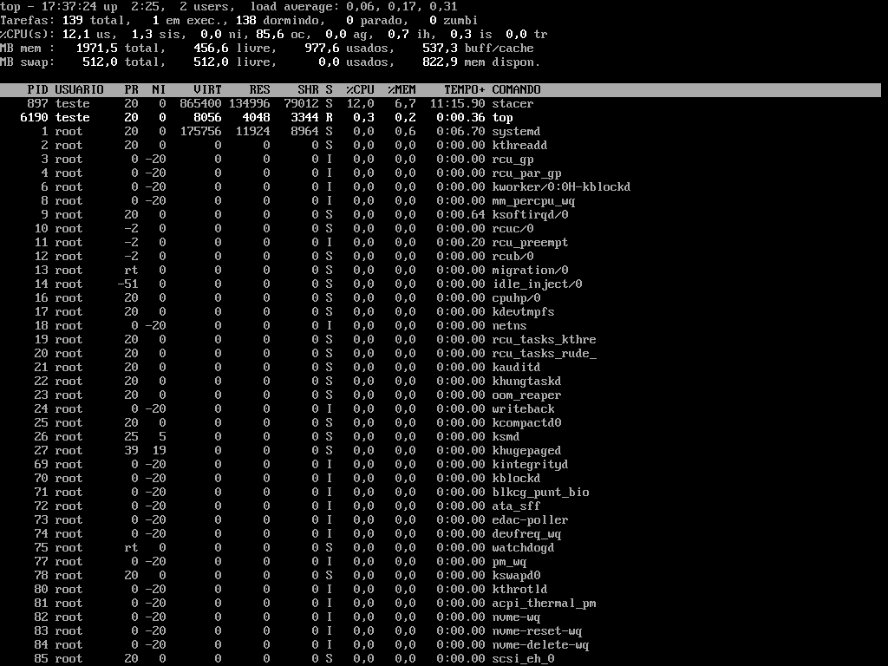
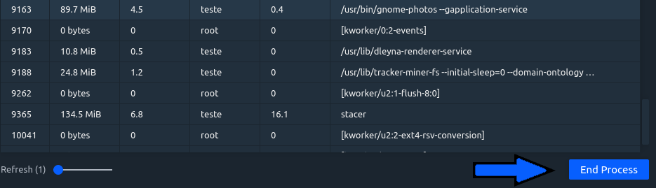

# ABA - PROCESSOS

## Stacer

Permite listar todos os processos no sistema e eventualmente encerrá-los, com os seguintes campos:
PID: Proccess Identificator
Resident Memory: memória alocada para o processo.
User: Usuário dono do processo.
Proccess: comando do processo

## Terminal

O mesmo é possível fazer com o terminal, usando o comando ps – aux ou top. O comando top mostra uma maior quantidade de informações, como swap de memória, estado dos processos e estatísticas de CPU, assim, sendo mais completo.

### Comparação entre o stacer e o terminal

Na interface gráfica, abrimos o aplicativo de fotos do gnome, ambiente gráfico que utilizamos para rodar o stacer.
Assim, podemos localizar o processo do programa gnome-photos, ver o seu PID, quanto de memória RAM está sendo alocado para o processo, o quanto esta quantidade de memória representa da memória total disponível no sistema, o dono do processo, o uso de CPU do processo, e a linha do comando do processo.

Com o comando top, podemos no terminal ver o mesmo processo, com as mesmas especificações.

Para encerrar um processo no stacer, devemos selecionar o processo a ser terminado e clicar no botão End Proccess.

É possível também fazer a mesma atividade no terminal com o comando kill seguido do PID do processo que se deseja encerrar.

# ABA - SERVIÇOS

  
De uma maneira teórica, um serviço pode ser um processo ou um grupo de processos, chamados de daemons rodando em background.
Os serviços no Arch Linux são gerenciados pelo Systemd, que substituiu o init, assim, os serviços rodam sobre o systemd.

## Stacer

Lista os serviços do sistema, e permite que o usuário escolha se o serviço deve iniciar quando o sistema botar e permite iniciar ou parar um serviço.

## Terminal

No terminal é possível listar todas as units carregadas usando o comando systemctl, lembrando que as units podem ser serviços (service), pontos de montagem (mount), dispositivos (device) ou soquetes (.socket). Então, para listarmos os serviços podemos usar o seguinte comando:
systemctl list-units --all --type=service

### Comparando o uso entre o serviço e o terminal

No stacer podemos habilitar facilmente habilitar a inicialização de um serviço quando o sistema inicia ou até mesmo iniciar ou desativar um serviço clicando no switch button.

O mesmo pode ser feito usando um systemctl start + nome do processo no terminal. Neste exemplo: systemctl start sshd (deverá ter permissão de root em ambos os casos).

Da mesma maneira que iniciamos um serviço no stacer, podemos parar, apenas clicando no botão. No terminal também é simples, se iniciamos o ssh com systemctl start sshd, podemos parar com systemctl stop sshd.

<strong>Edson dos Santos Junior RA 0040481921012</strong>

