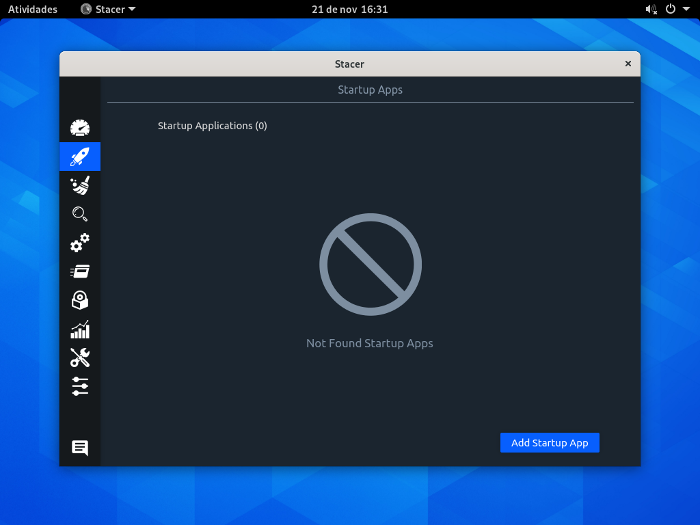
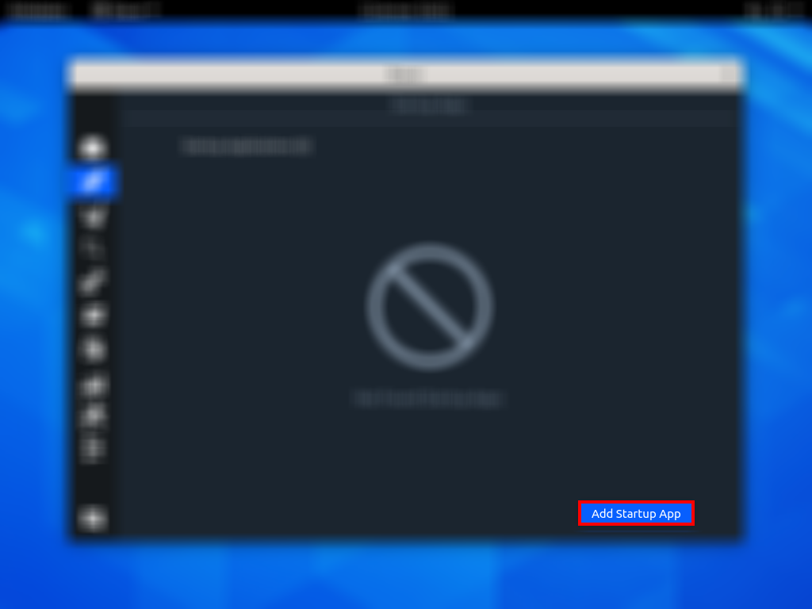
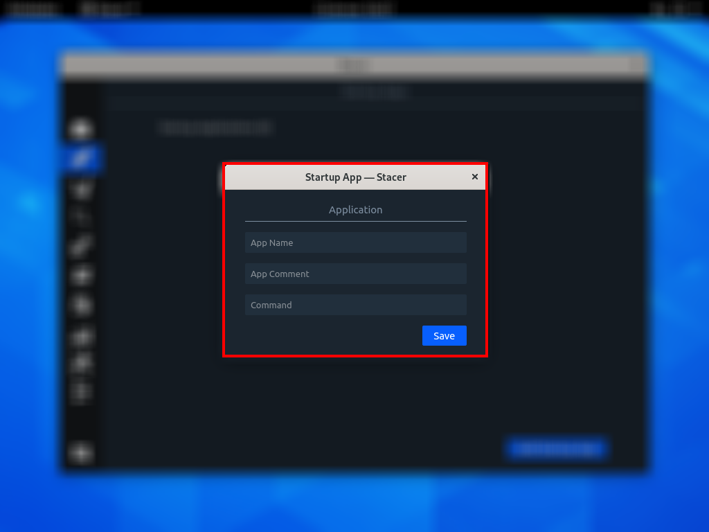
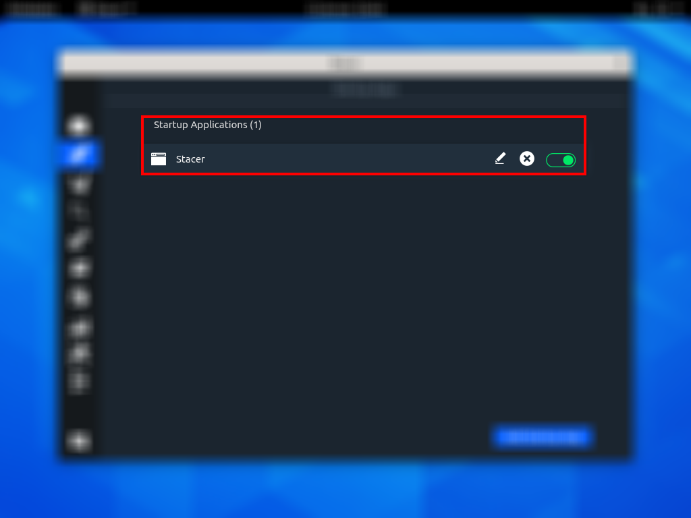

# ABA – STARTUP APPS
Nesta aba é possível gerenciar os programas que serão inicializados após o boot.

## LISTA DE APPS
Esta é a lista dos programas que serão inicializados após o boot.

## BOTÃO PARA ADICIONAR APPS
Este é o botão para adicionar novos programas.

## ADICIONANDO NOVOS APPS
Após apertar o botão surge esta janela, onde é possível adicionar o nome que aparecerá na lista, um comentário e o comando para inicializar algum programa(este comando geralmente é o próprio nome do programa).

## APP ADICIONADO
Depois de adicionado, o programa passará a ser exibido na lista, é possível editar, excluir ou desativar a inicialização do programa diretamente pela lista.

