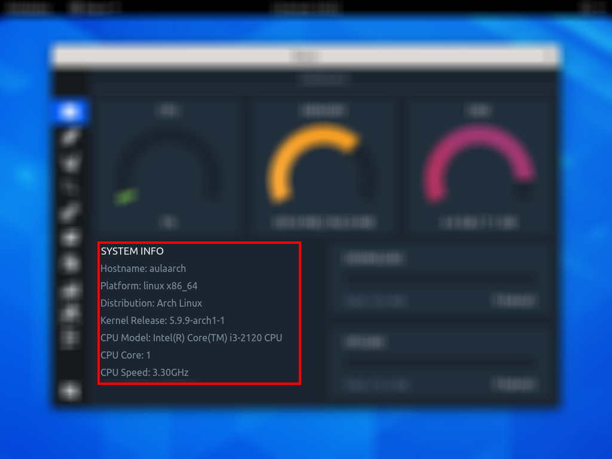

# ABA - MONITORAMENTO DO SISTEMA
Esta aba é responsável por mostrar o funcionamento do computador ao usuário, nela é possível analisar informações que estão divididas em três blocos.

## PRIMEIRO BLOCO – USO DE RECURSOS DO SISTEMA
Este bloco faz  o monitoramento dos recursos do computador, tais como a CPU, a Memória RAM e o Disco Rígido.

## SEGUNDO BLOCO – INFORMAÇÕES DO SISTEMA
Este bloco exibe as informações do sistema operacional e do processador.

### INFORMAÇÕES DO SISTEMA OPERACIONAL
Sobre o sistema operacional é exibido a plataforma, a distribuição desta plataforma e a versão do kernel utilizado.

### INFORMAÇÕES DO PROCESSADOR
Sobre o processador é exibido o modelo, a quantidade de cores e sua frequência.

## TERCEIRO BLOCO – USO DA INTERNET
Neste bloco são exibidas as informações sobre a internet do usuário, nela é exibido a quantidade total e o uso do download e upload.

