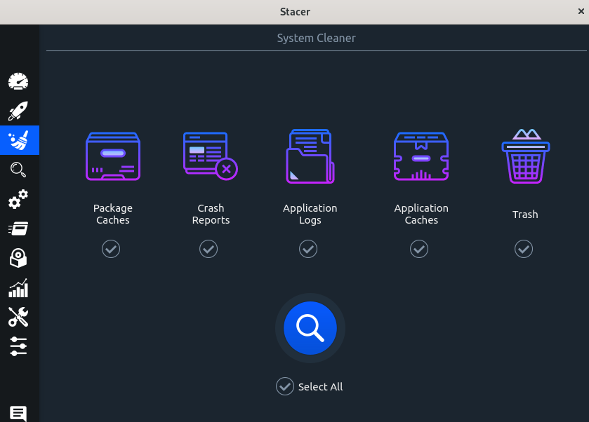
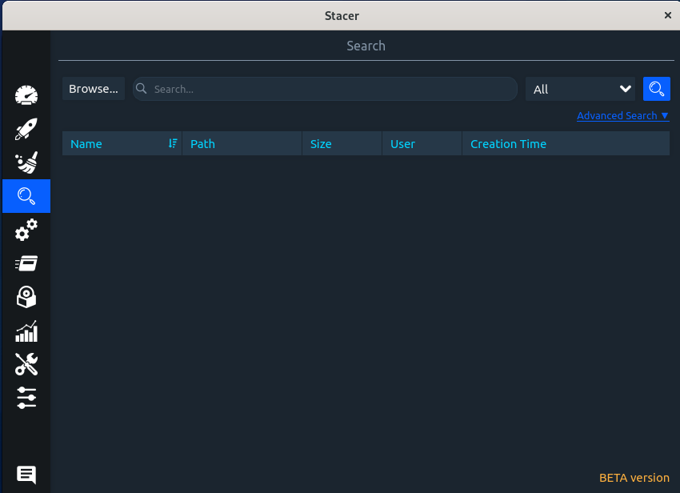
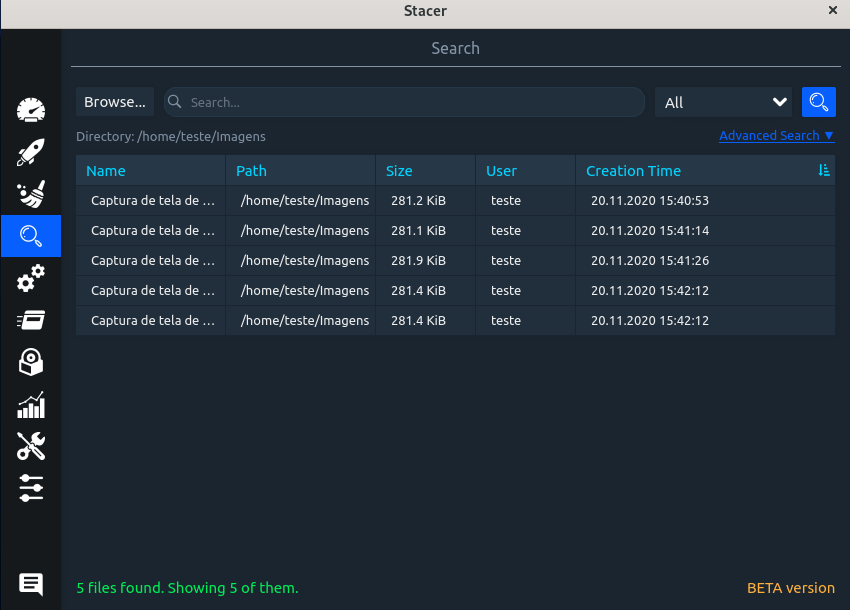

# System Cleaner

Com ele é possível limpar lixo, cachê e logs das aplicações de uma maneira mais fácil, basta selecionar as opções desejadas.
Pode ser comparada ao comando rm no terminal.
Exemplo para limpar o lixo via terminal : rm -rf ~/.local/share/Trash/files/*

# Search

Nessa aba é possível pesquisar e visualizar os arquivos contidos em determinado diretório. Mostra-se o nome, o caminho, o tamanho, o usuário dono, e a data de criação do arquivo.
Pode ser comparado os ls -l e ao comando find no terminal.

