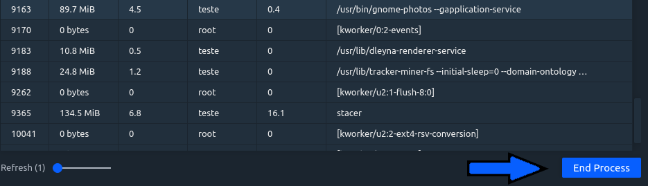
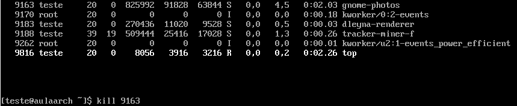

# ABA - PROCESSOS

## Stacer

Permite listar todos os processos no sistema e eventualmente encerrá-los, com os seguintes campos:
PID: Proccess Identificator
Resident Memory: memória alocada para o processo.
User: Usuário dono do processo.
Proccess: comando do processo

## Terminal

O mesmo é possível fazer com o terminal, usando o comando ps – aux ou top. O comando top mostra uma maior quantidade de informações, como swap de memória, estado dos processos e estatísticas de CPU, assim, sendo mais completo.

### Comparação entre o stacer e o terminal

Na interface gráfica, abrimos o aplicativo de fotos do gnome, ambiente gráfico que utilizamos para rodar o stacer.
Assim, podemos localizar o processo do programa gnome-photos, ver o seu PID, quanto de memória RAM está sendo alocado para o processo, o quanto esta quantidade de memória representa da memória total disponível no sistema, o dono do processo, o uso de CPU do processo, e a linha do comando do processo.

Com o comando top, podemos no terminal ver o mesmo processo, com as mesmas especificações.

Para encerrar um processo no stacer, devemos selecionar o processo a ser terminado e clicar no botão End Proccess.

É possível também fazer a mesma atividade no terminal com o comando kill seguido do PID do processo que se deseja encerrar.

<strong>Edson dos Santos Junior RA 0040481921012</strong>

