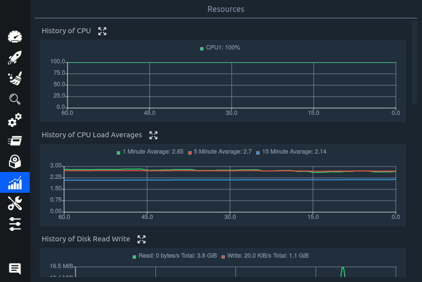
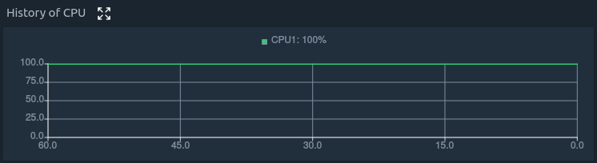
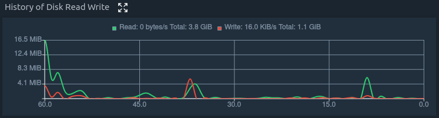
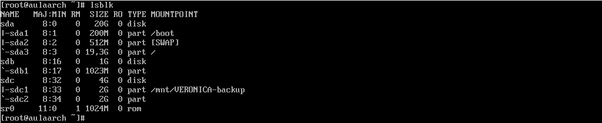
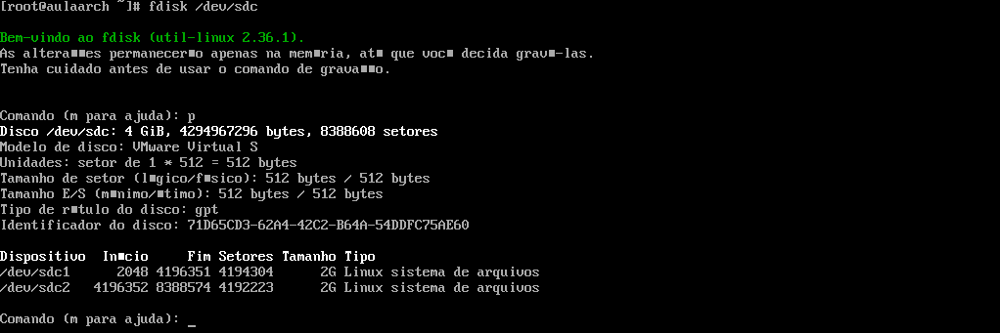

# ABA - RECURSOS 

## Stacer

A aba "Resources" mostra o histórico de vários componentes da máquina.

O Histórico do CPU 

Histórico da média de trabalho do CPU 

Histórico de Leitura e Escrita de Disco

Histórico de Memória 

 

Histórico de Rede

O Stacer mostra também os dispositivos de armazenamento conforme a figura abaixo:

## Terminal 

Para mostrar pelo terminal os dispositivos de armazenamento, basta usar o comando `lsblk`.

 

## Stacer

Ao final temos o Sistema de Arquivo: 

## Terminal 

Para mostrar pelo terminal o Sistema de Arquivo pode ser utilizado o comando `mount` que irá mostrar os tipos de arquivos, porém de maneira desordenada.

 

Sendo assim, há outro comando que mostra a quantidade utilizada de disco na partição escolhida, mostrando o tipo de arquivo utilizado `fdisk /dev/{partição desejada}`, na imagem abaixo foi utilizada a partição sdc para visualizar, ficando então: `fdisk /dev/sdc`:

 

<strong>Verônica da Silva Martins RA 0040481921024</strong>