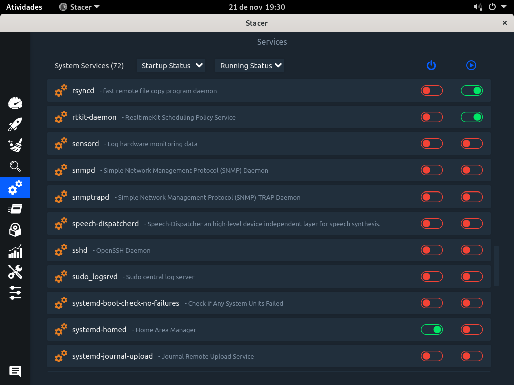
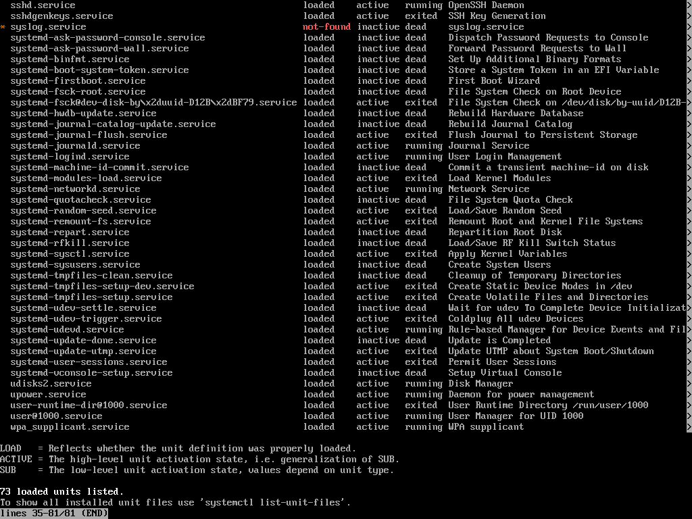
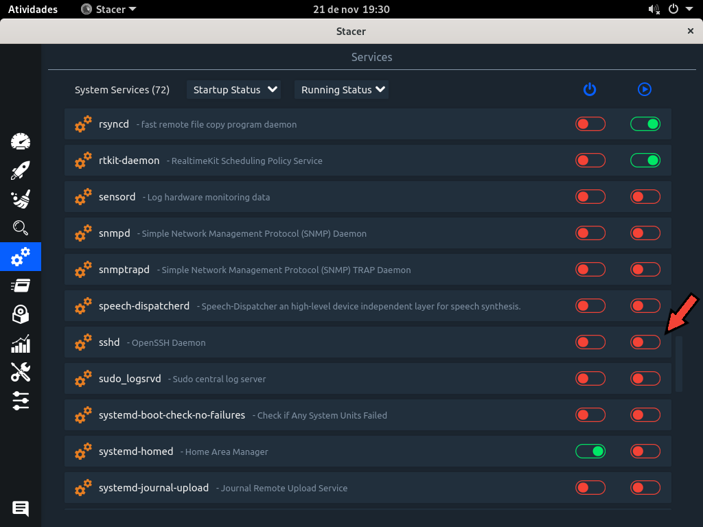
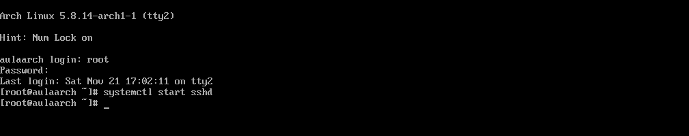

# ABA - SERVIÇOS

  
De uma maneira teórica, um serviço pode ser um processo ou um grupo de processos, chamados de daemons rodando em background.
Os serviços no Arch Linux são gerenciados pelo Systemd, que substituiu o init, assim, os serviços rodam sobre o systemd.

## Stacer

Lista os serviços do sistema, e permite que o usuário escolha se o serviço deve iniciar quando o sistema botar e permite iniciar ou parar um serviço.

## Terminal

No terminal é possível listar todas as units carregadas usando o comando systemctl, lembrando que as units podem ser serviços (service), pontos de montagem (mount), dispositivos (device) ou soquetes (.socket). Então, para listarmos os serviços podemos usar o seguinte comando:
systemctl list-units --all --type=service

### Comparando o uso entre o serviço e o terminal

No stacer podemos habilitar facilmente habilitar a inicialização de um serviço quando o sistema inicia ou até mesmo iniciar ou desativar um serviço clicando no switch button.

O mesmo pode ser feito usando um systemctl start + nome do processo no terminal. Neste exemplo: systemctl start sshd (deverá ter permissão de root em ambos os casos).

Da mesma maneira que iniciamos um serviço no stacer, podemos parar, apenas clicando no botão. No terminal também é simples, se iniciamos o ssh com systemctl start sshd, podemos parar com systemctl stop sshd.

<strong>Edson dos Santos Junior RA 0040481921012</strong>

