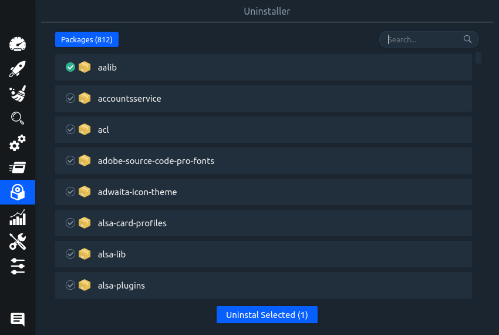
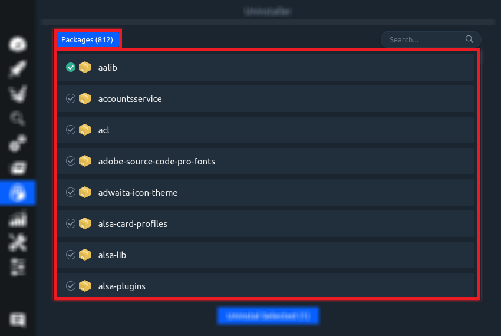
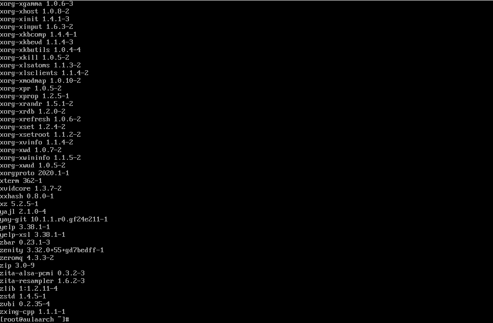
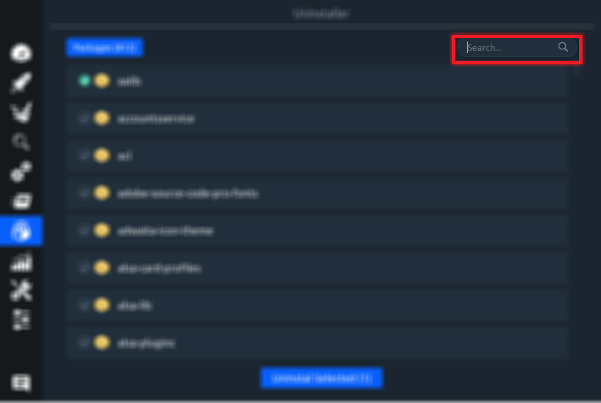
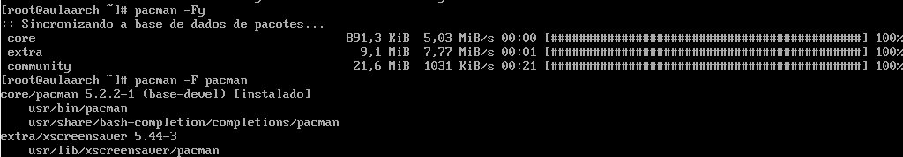
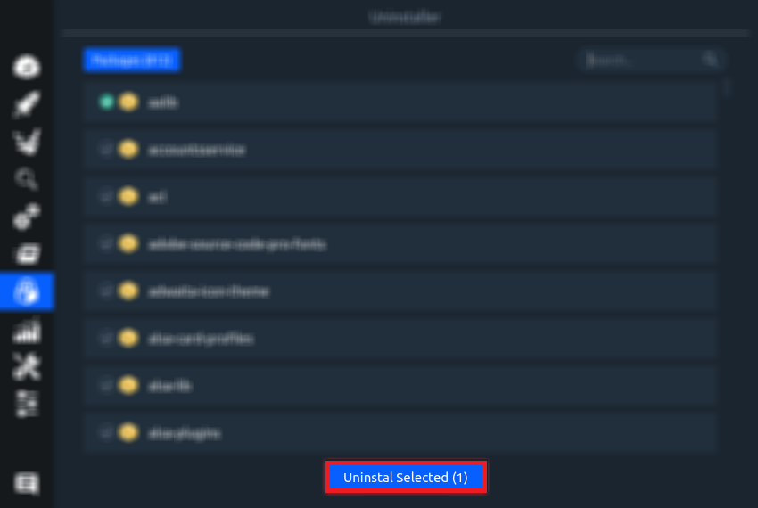
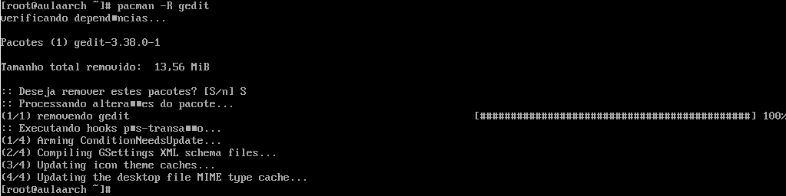

# ABA - DESINSTALADOR

## Stacer

A aba "Uninstaller" permite desinstalar o pacote desejado.

 

Nessa aba há a quantidade e a listagem de pacotes instalados.

 

## Terminal 

O equivalente à listagem dos pacotes do Stacer no Arch Linux é o comando `sudo pacman -Q`:

 

## Stacer

Há também um campo de pesquisa, que ajuda o usuário a encontrar com mais facilidade o pacote que deseja desinstalar.

 

## Terminal 

No terminal antes de fazer uma pesquisa de pacote necessário atualizar os pacotes com o comando `pacman -Fy`.
Após a sincronização é só rodar o comando `pacman -F {nome do pacote}`, exemplo: `pacman -F pacman`.

 

## Stacer

Para desinstalar um ou mais pacotes selecionados é só clicar no botão "Uninstall Selected".

 

## Terminal 

Para desinstalar direto pelo terminal, utiliza-se o comando `pacman -R {nome do pacote}`, no caso da imagem foi escolhido o pacote gedit, ficando da seguinte maneira: `pacman -R gedit`.

 

<strong>Verônica da Silva Martins RA 0040481921024</strong>